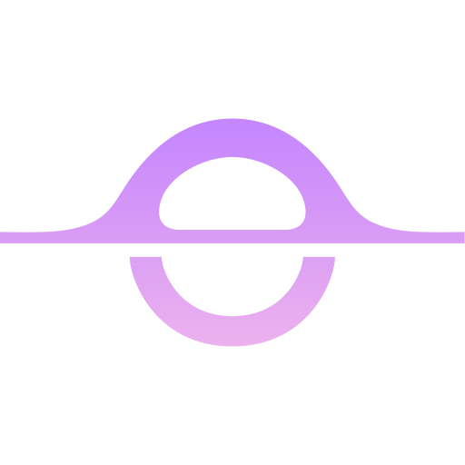
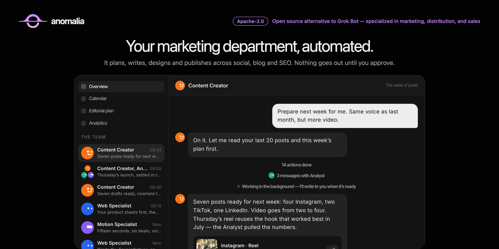

<p align="center">
  
</p>

<h1 align="center">Anomalia</h1>

<p align="center">
  <a href="https://github.com/anomaliaso/anomalia/stargazers"></a>
  <a href="https://discord.gg/PUp37DG6vr"></a>
  <a href="LICENSE"></a>
  <a href="https://anomalia.so"></a>
</p>



Your marketing department, automated. Anomalia is an open-source Grok Bot
alternative specialized in marketing, distribution, and sales. It plans, writes,
designs, and publishes across social, blog, and SEO — nothing goes out until you
approve. Use it hosted at [anomalia.so](https://anomalia.so), or run the complete
stack yourself.

## Features

- Weekly editorial plan, then on-brand posts, carousels, and video
- Calendar and one-tap approve — from the app, email, or
  [CLI / MCP](cli/)
- Studio: brand kit, products, people, competitors, and voice
- Radar: news and conversations turned into drafts and lead replies
- Blog, SEO, and GEO — rank on Google and get cited by AI assistants
- Multi-brand workspaces (one account, many brands)
- Propose-approve throughout: the AI never publishes silently
- Drive it from Cursor or Claude via MCP, or from the `anomalia` CLI

## Stack

- TypeScript and SvelteKit
- Supabase (Postgres, Auth, Storage)
- Node.js 22 and Docker Compose
- MCP server and CLI in [`cli/`](cli/) — installable binary, npm, Homebrew

## Quick start

You need Node.js 22+, Docker with Compose, and openssl.

```sh
cp infra/compose/.env.example infra/compose/.env   # fill POSTGRES_PASSWORD, DASHBOARD_PASSWORD, SECRET_KEY_BASE
cp .env.example .env                               # set PUBLIC_SUPABASE_URL=http://localhost:8000 and copy ANON_KEY / SERVICE_ROLE_KEY from infra/compose/.env into PUBLIC_SUPABASE_ANON_KEY / SUPABASE_SERVICE_ROLE_KEY
(cd infra/compose && docker compose up -d --wait db kong auth rest realtime storage)
npm install

export DATABASE_URL="postgres://postgres:<POSTGRES_PASSWORD>@localhost:5432/postgres"
npm run db:migrate
(cd infra/compose && docker compose --profile init run --rm realtime-policies)
npm run db:seed
npm run dev          # http://localhost:5173 — login with the seeded demo@example.com / change-me-now-12345
```

`--wait` is required: migrate needs tables that storage and realtime create on
startup. The `realtime-policies` init runs after Realtime health and is safe to
repeat; it records 0226 only after both policies exist.

`db:seed` prints the `TENANT_BRAND_ID` line to paste into `.env` for a
single-brand install. The demo login comes from `SEED_DEMO_EMAIL` /
`SEED_DEMO_PASSWORD` if you want different ones. Skip the compose step if you
already have a hosted Supabase project — point the same keys at it.

Production: `npm run build:node && npm start` (port 3000), or from
`infra/compose/`: `docker compose up -d --build app`.

Read [`docs/SELF_HOSTING.md`](docs/SELF_HOSTING.md) for the complete guide.

## Contributing

Contributions are welcome. Please read [CONTRIBUTING.md](./CONTRIBUTING.md)
before opening a pull request. For security vulnerabilities, follow
[SECURITY.md](./SECURITY.md) instead of filing a public issue.

Anomalia is licensed under the [Apache License 2.0](./LICENSE).

Questions and ideas are welcome in the
[Discord community](https://discord.gg/PUp37DG6vr).
