# Anomalia con agenti esterni

Status: proposed
Last updated: 2026-09-03

## Outcome

Anomalia becomes the persistent control plane for external AI clients. Claude,
Cursor, ChatGPT, and compatible clients do the reasoning and text authoring with
the user's own model account. Anomalia stores brand knowledge and artifacts,
connects services, enforces review, publishes, measures results, and presents
work to the agency and its clients.

The first complete workflow is:

```text
External AI reads the brand
            |
            v
External AI writes the plan and posts
            |
            v
Anomalia stores dated pending posts
            |
            v
Operator reviews and publishes
            |
            v
Client sees a public calendar or report
```

## Product boundary

| Responsibility | Owner |
| --- | --- |
| Reasoning, copy, plans, revisions in the external workflow | User's external AI client |
| Managed auto-blog, SEO/GEO, and social autopilot | Anomalia |
| Brand memory, posts, calendar, assets | Anomalia |
| Conversion from creative direction to publishable social assets | Anomalia |
| Connectors, publishing, analytics | Anomalia |
| Review and approval | Operator in Anomalia or through a confirmed MCP action |
| Client presentation | Public Anomalia views |

Anomalia does not ask for the user's Claude, OpenAI, or Cursor API key. The user
pays their AI provider through their existing account and authorizes Anomalia
separately through MCP OAuth.

Text generation inside Anomalia becomes an optional managed service rather than
the only path. Three managed engines remain first-class because they already
produce useful work: auto-blog, SEO/GEO with citation research, and social
autopilot. The external agent can use their output, revise it, or create social
content independently. Image generation, video generation, rendering, audits,
and other model-backed operations remain explicit paid Anomalia capabilities.

## Actors

**Operator**: a person accountable for work performed on a brand.

**Agency operator**: an operator who manages one or more brands for clients.

**Owner operator**: an operator who manages a brand for their own organization.

**Client viewer**: a client stakeholder who receives a scoped public view but
cannot operate the brand.

**External agent**: an AI client authorized by an operator and powered by the
operator's own model account. It acts outside Anomalia's own agent team.

**Managed AI**: an explicit model-backed operation executed and billed by
Anomalia.

An Agency operator and an Owner operator receive the same brand capabilities.
Their use cases differ; the product does not fork.

## Mappe essenziali

### Il prodotto

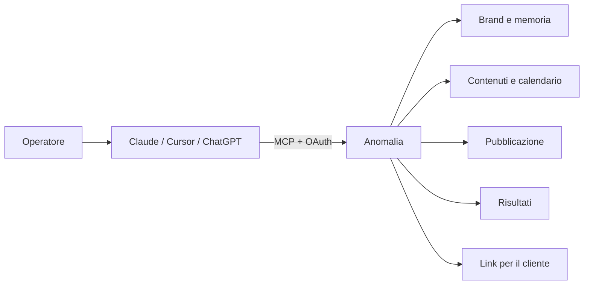

L'AI pensa e scrive. Anomalia conserva, controlla, pubblica e misura.

### I due percorsi

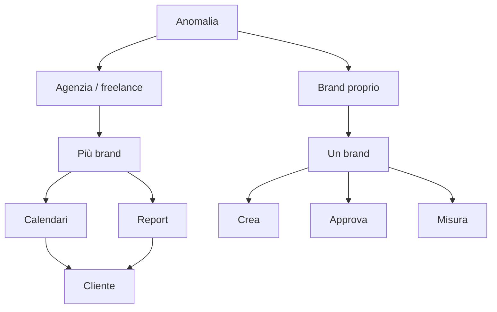

Stesse capacità. L'agenzia consegna a terzi; l'Owner operator lavora per sé.

### Cosa può fare l'agente esterno

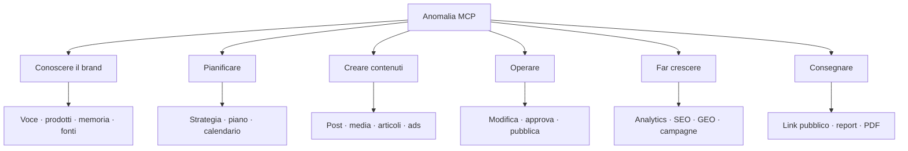

### Il ciclo completo

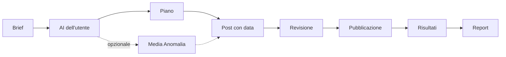

Creazione e data non autorizzano la distribuzione. Con il contratto attuale,
`approve_post` autorizza e avvia la programmazione; `publish_post` pubblica subito.

### I tre motori

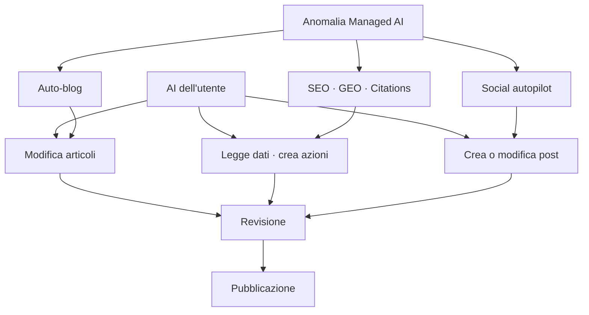

Anomalia può produrre. L'AI dell'utente può partire da quel lavoro o sostituirlo.
I dati grezzi di audit e citation restano prove, non testo modificabile.

### Social: tre modalità

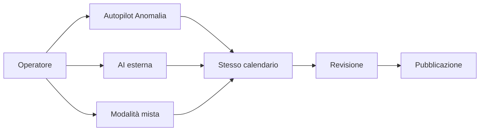

Sono tre percorsi combinabili, non un interruttore globale del brand.

### Il valore nei social

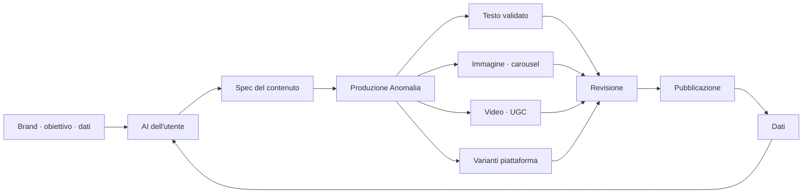

### Come Anomalia migliora l'AI esterna

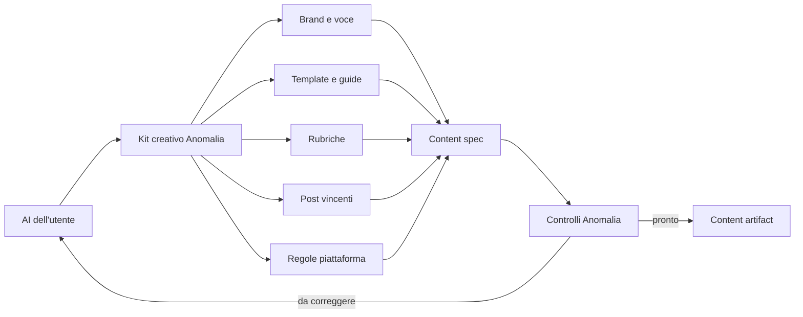

Anomalia non sostituisce il modello: gli consegna contesto selezionato e verifica
il risultato prima che entri nel calendario.

### Cosa resta da chiudere

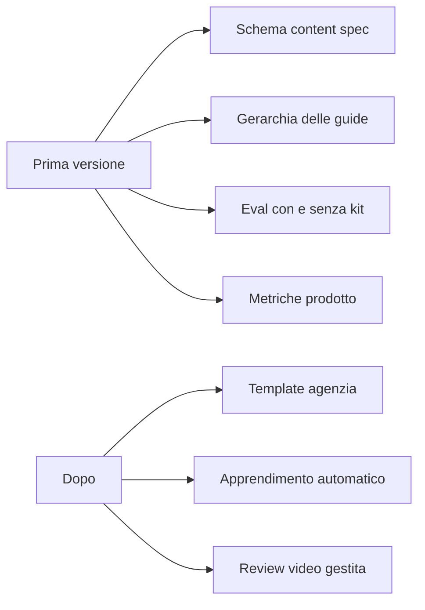

### Posizionamento

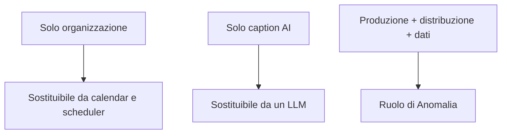

### Focus

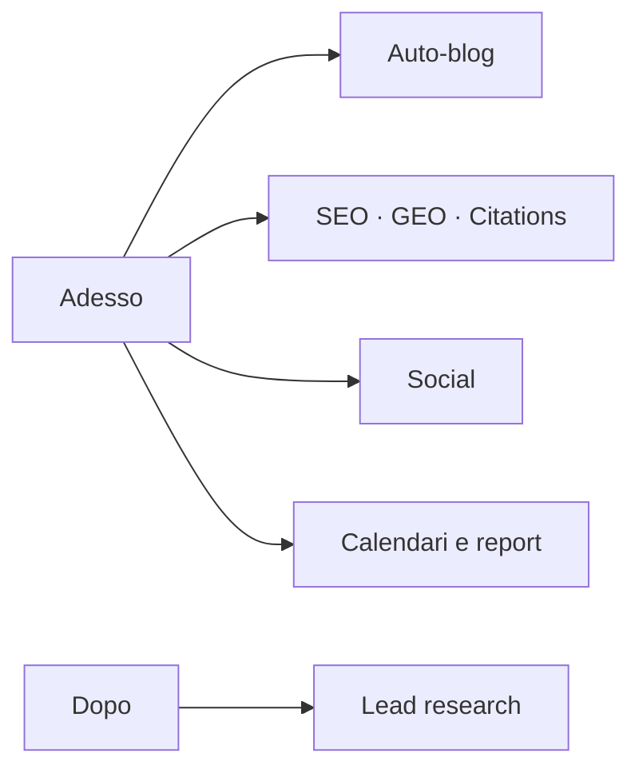

### Frontend

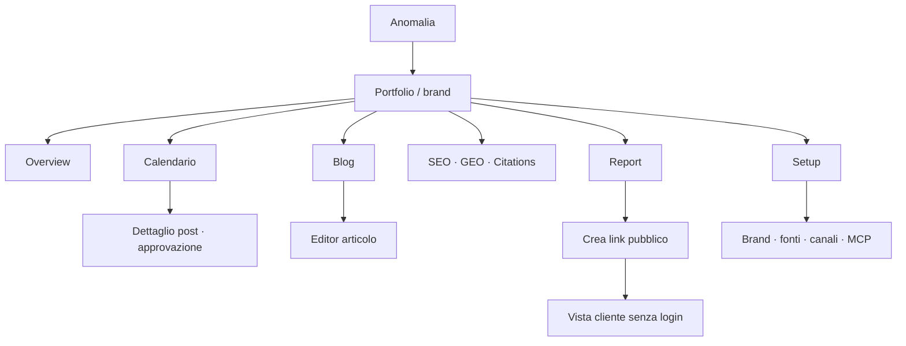

Il calendario assorbe coda approvazioni e dettaglio post. Setup raccoglie le
configurazioni. Nessuna chat nella navigazione primaria.

### Onboarding e setup

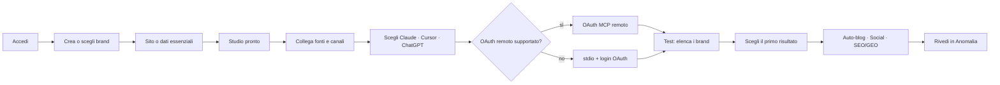

L'identità OAuth esistente viene verificata, non ricostruita. Il trasporto segue
il client.

### Oggi e prossimo passo

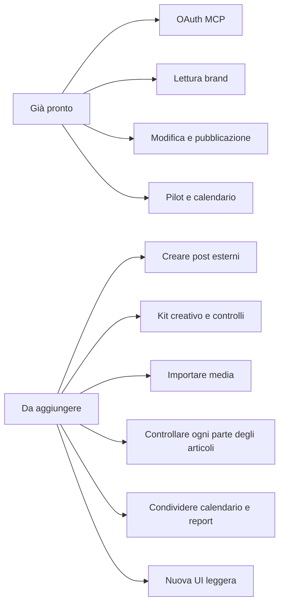

### Ordine di costruzione

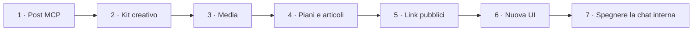

## Existing foundation

These parts already work and must be reused:

- Local and remote MCP servers.
- OAuth identity shared by MCP and CLI; static tokens are not the product path.
- Brand, dashboard, calendar, post, analytics, plan, studio, SEO, GEO, article,
  ads, and chat MCP tools.
- The operational plan-to-post-to-calendar pilot.
- Auto-blog generation, optimization, scheduling, and publishing.
- SEO/GEO audits, generated artifacts, and grounded citations.
- Internal article tools already read, update, schedule, optimize, and generate
  covers or in-body images.
- Manual post creation in the web UI.
- `createManualPost` as the server-side path for user-authored posts.
- REST API v1 as the boundary used by CLI and MCP.
- Auth, billing, Composio connections, publishing, analytics, and storage.
- Tailwind CSS 4, shadcn-svelte, and Bits UI already configured in the app.

OAuth and the operational pilot are foundations, not work to rebuild. Client
onboarding and compatibility still require release checks in each supported
client.

## Current gap

The manual-posting UI can create a post without text generation, but MCP cannot.
The current MCP can list, edit, approve, schedule, render, publish, and delete an
existing post. It has no direct post-creation tool.

For articles, public MCP can list summaries, generate, optimize, publish,
unpublish, and delete. It cannot read a complete draft or directly edit its
content, SEO, cover, taxonomy, author, translation, or schedule. Equivalent
read, edit, schedule, cover, and image operations already exist in the web app
or internal agent and should be bridged through the shared application layer.
Article video is not a current domain field: raw HTML and iframe embeds are
escaped by the public renderer, so safe video blocks require a new capability.

`GET` and `DELETE /api/v1/brands/:slug/posts` exist. `POST` does not. Creation
through `plan_week`, `produce_week`, `generate_article`, and `chat` still invokes
Anomalia-managed AI in relevant paths. That is intentional for auto-blog,
SEO/GEO, citations, and social autopilot. Deterministic external-authoring paths
must coexist with them.

The current manual-posting mode also combines two separate decisions:

1. where a post belongs in the calendar;
2. whether the post is authorized for scheduling or publication.

An external agent needs permission to make a dated draft without receiving
permission to publish it.

## Rules

### External authoring

- External AI may create complete posts and place them in the calendar.
- Direct creation performs no text-model call and consumes no text-AI credits.
- Created posts start as `pending_user`.
- On a pending post, `scheduled_for` is the proposed publication instant. It
  causes no external scheduling while status remains `pending_user`.
- `slot` is derived in the brand timezone for the current calendar and approval
  fallback; it is not a second authorization signal.
- `get_calendar` includes a dated pending post only in its selected month and
  returns undated drafts separately from calendar items.
- Approval is the consequential transition that authorizes external scheduling.
- Immediate publication remains a separate consequential action.
- Existing platform limits, media requirements, brand ownership, quota, and
  publishing invariants apply equally to UI, REST, CLI, and MCP.
- Routes call the shared application service. They never reproduce post-row
  assembly or write directly to the database.

### External media

- Agents can discover and reuse the brand's media library.
- A public HTTPS image or video can be imported into Anomalia before use.
- Imported media is validated, size-limited, copied to Anomalia storage, and
  recorded with its origin.
- URL import blocks private networks, redirects to private networks, invalid
  MIME types, and oversized responses.
- Large base64 payloads are not the primary MCP transport.
- Device-only files continue to use the web upload flow until a client-neutral
  transport proves necessary.

### Publishing

- `destructiveHint` remains useful client metadata, not server authorization.
- Agent-created posts enter review instead of publishing immediately.
- Current `approve_post` and `approve_posts` semantics are preserved: the tool
  call authorizes and attempts external scheduling or publication immediately.
- Tool names, descriptions, and results must state that effect plainly; an
  approval-only state is not introduced in version one.
- Version one relies on explicit operator intent and the external client's
  confirmation UI. The authenticated server call then executes immediately.
- Anomalia enforces identity, brand scope, state, and validation, but does not
  claim cryptographic proof of a human click.
- A server-held approval policy or one-time action token is later work if client
  confirmation proves inconsistent.

### Managed engines

- Auto-blog remains an Anomalia product, not a migration fallback.
- SEO/GEO reports, audits, artifacts, and citation collection remain Anomalia
  capabilities.
- Social supports `autopilot`, `external`, and `mixed` modes over the same posts
  and calendar.
- These are combinable work styles, not a brand-wide mode setting.
- Every managed operation is labelled before execution and reports its cost.
- Direct edits call no model and consume no text-AI credits.
- External and managed outputs use the same review and publication lifecycle.

### Social production boundary

Anomalia helps create social content, not only organize it. Its core job is to
turn a creative direction into a validated, reviewable, publishable artifact.

The external agent owns by default:

- editorial reasoning, ideas, hooks, copy, and revision instructions;
- selection of objective, audience, format, platforms, and calendar intent;
- interpretation of performance and the next creative hypothesis.

Anomalia owns:

- brand context, products, people, approved assets, and past performance;
- structured post state and platform-specific validation;
- media reuse and import;
- optional image, carousel, thumbnail, motion, and UGC production;
- previews, versions, approvals, scheduling, publishing, and delivery status;
- performance collection and durable history.

Social autopilot may perform both sides as an explicit managed workflow. In the
external and mixed workflows, text reasoning stays with the user's model while
Anomalia supplies the production and operational layer. Users may import their
own finished media instead of buying an Anomalia render.

The social unit passed from the external agent to Anomalia is a **content spec**:
copy, platforms, format, media direction or asset references, optional variants,
and calendar intent. The stored result is a **content artifact** ready for review.

### Creative intelligence layer

Anomalia improves the user's model before and after creation.

Before creation, one **creation kit** returns only the context relevant to the
requested goal, platform, and format:

- brand voice, products, people, approved assets, and factual constraints;
- one suitable format template and its platform playbook;
- approved recurring rubrics and their art direction;
- relevant past winners, weak patterns, and operator before/after edits;
- occupied calendar slots and current campaign context.

After creation, Anomalia checks the returned content spec:

- deterministic platform limits, required fields, media compatibility, and
  scheduling conflicts;
- copy quality: hook, specificity, repetition, unsupported claims, CTA, length,
  hashtags, emoji, readability, and AI-writing tells;
- rubric cadence and format consistency;
- visual legibility, hierarchy, palette, safe area, and rendering integrity;
- video duration, aspect ratio, script budget, audio presence, and render state.

The first public surface stays small:

- `get_creation_kit` selects guidance and examples;
- `check_content` runs deterministic checks and returns exact fixes;
- `review_media` performs an optional perceptual review when a supported model is
  deliberately requested.

Static guides and templates are versioned reference material. Dynamic tools
select the smallest relevant subset; they never dump the full library into every
model turn.

Finished-video review has two levels:

1. A free review packet contains metadata, transcript, audio facts, and sampled
   frames for the user's multimodal model.
2. An optional managed review may judge hook, first seconds, hold, authenticity,
   and CTA with a video-capable model.

The previous finished-video reviewer was removed after its provider stopped
accepting video input. It is `Build`, not an available capability, until a real
MP4 evaluation proves the replacement works. Script review, render checks, and
motion-frame review remain separate capabilities.

### Article control

- The external agent can read the complete article in every status.
- It can edit title, body, SEO fields, cover, in-body images, video blocks,
  language, translation, category, tags, author, and schedule.
- It can reuse or import media without asking Anomalia to generate it.
- Anomalia generation, optimization, covers, and in-body images remain optional
  managed actions.
- Editing one field never regenerates another.
- Changes to a published article create a revision; making that revision live is
  a separate consequential action.
- Video uses a typed, allowlisted media block. Raw article HTML remains escaped.

### Evidence control

- Audit observations, citation URLs, timestamps, and measured values are
  immutable evidence.
- The external agent can read evidence, trigger a refresh, add notes, propose
  fixes, and create an editable client report from it.
- User-authored narrative never overwrites the evidence that supports it.

### Public sharing

- A public link grants access to one declared view, never to a brand account.
- Public views expose presentation data only: calendar, selected post previews,
  or a report snapshot.
- Tokens are opaque, stored hashed, revocable, and optionally expiring.
- Connector data, internal notes, prompts, costs, settings, member data, and
  private identifiers stay private.
- Version one uses revocable snapshots. A live calendar is a later mode after
  its privacy and cache behavior are proven.
- PDF export renders the same snapshot shown by the public URL.

## Product capability map

<details>
<summary>Catalogo dettagliato delle capacità</summary>

### Capability states

| State | Meaning |
| --- | --- |
| Available | Exposed through MCP now |
| Bridge | Exists in Anomalia REST or web UI and needs MCP exposure |
| Internal | Tested server behavior or reference material without a public application seam |
| Build | Requires a new product capability |
| Managed | Invokes Anomalia-managed AI |

`Managed` may coexist with another state. It identifies who performs the model
work, not whether the capability exists.

### Access and portfolio

| Capability | State | External-agent possibility |
| --- | --- | --- |
| OAuth login and logout | Available | Authorize Anomalia without sharing a static key |
| Identify the current account | Available | Verify which operator is acting |
| List accessible brands | Available | Discover a personal or agency portfolio |
| Read dashboard and status | Available | Find pending work, recent runs, and account readiness |
| Compare several brands | Available by composition | Read each brand and produce a portfolio summary |
| Create a brand | Build for MCP | Start a new client or owned brand from the external client |
| Manage brand members and roles | Bridge | Invite collaborators and control workspace access |

Every brand-scoped tool requires an explicit brand slug. A portfolio request may
span brands; one tool call never silently does.

### Brand foundation

| Capability | State | External-agent possibility |
| --- | --- | --- |
| Read the complete studio | Available | Understand brand, products, people, documents, competitors, and history |
| Update brand kit and colors | Available | Correct audience, positioning inputs, language, and palette |
| Read and update voice | Available | Maintain tone, register, avoided language, and platform instructions |
| Add and remove notes/documents | Available | Persist facts learned in email, meetings, or research |
| Read and edit granular memory | Bridge | Maintain durable facts without replacing the studio |
| List products | Available | Ground content and campaigns in real offers |
| Create, edit, and remove products | Bridge | Maintain the catalog from an external source |
| Add and remove people | Available | Manage approved real people and generated talent |
| Edit people | Bridge | Keep roles, descriptions, and attributes current |
| Add and remove competitors | Available | Maintain the competitive set |
| Edit competitors | Bridge | Correct websites and rationale |
| Research competitors | Available, Managed | Ask Anomalia to research and store findings |
| Sync social history | Available | Import past posts and performance context |
| Read and update public bio | Bridge | Keep the outward brand description current |

### Connections and knowledge sources

| Capability | State | External-agent possibility |
| --- | --- | --- |
| List connector catalog | Bridge | Discover apps available to the brand |
| List active connections | Bridge | Check whether a source is ready |
| Start a connection | Bridge | Return an authorization URL for the operator |
| Complete or disconnect a connection | Bridge | Confirm or revoke access |
| Read connected knowledge | Available indirectly | Use ingested documents through studio reads |
| Call integration tools | Build for public MCP | Act through brand-scoped Composio connections |
| Configure outbound webhooks | Bridge | Send selected brand events to the operator's system |

OAuth consent remains a human browser step. An external agent may initiate it
and inspect completion; it cannot consent for the operator.

### Strategy and planning

| Capability | State | External-agent possibility |
| --- | --- | --- |
| Read editorial plan | Available | Understand cadence, themes, weeks, and pending proposals |
| Generate or revise a proposal | Available, Managed | Ask Anomalia AI for a plan |
| Approve or discard a proposal | Available | Move an existing proposal through review |
| Save weekly briefs | Available | Add operator direction and featured products |
| Replan a week | Available, Managed | Ask Anomalia AI to revise one week |
| Read weekly seeds and posts | Available | Inspect what a week contains |
| Generate or produce a week | Available, Managed | Ask Anomalia AI to create seeds or posts |
| Save an externally authored plan | Build | Persist a plan written by the external agent |
| Save externally authored seeds | Bridge | Persist structured weekly ideas without generation |
| Read GTM roadmap | Available | Ground content in the current commercial phase |
| Update GTM roadmap | Bridge | Apply externally reasoned objectives, phases, weights, and pillars |
| Read, propose, and approve rubrics | Bridge, partly Managed | Manage recurring editorial formats |
| Read and add idea-bank entries | Bridge | Store ideas found by the external agent |
| Read and update field watch | Bridge | Track meaningful movement in the market |
| Diagnose brand readiness | Bridge | Explain the first blocked gate and how to unlock it |
| Diagnose radar sources | Bridge | Explain why a monitored source finds nothing |

### Social content and calendar

| Capability | State | External-agent possibility |
| --- | --- | --- |
| List and inspect posts | Available | Review copy, state, dates, and media |
| Read a monthly calendar | Available | Plan around occupied dates and campaigns |
| Edit post fields | Available | Rewrite copy, links, platforms, metadata, and media references |
| Move a post | Available | Change its calendar placement |
| Approve one or all posts | Available, consequential | Authorize and attempt external scheduling/publication immediately |
| Publish immediately | Available, consequential | Publish a selected approved post |
| Reject or delete | Available, consequential | Remove unwanted work |
| Revoke scheduled publication | Bridge, consequential | Pull a post back from its external scheduler |
| Create an externally authored post | Build | Store external copy as a dated pending post |
| Create several posts in one operation | Build | Persist a complete external calendar efficiently |
| Run social autopilot | Available, Managed | Let Anomalia keep producing posts automatically |
| Mix managed and external posts | Bridge | Edit, replace, or extend autopilot work in one calendar |
| Submit a complete content spec | Build | Turn external direction into one validated post artifact |
| Validate platform readiness | Bridge | Catch missing media, limits, and incompatible formats before approval |
| Create platform variants | Available by composition | Adapt one concept while keeping each channel's copy and media explicit |
| Get a focused creation kit | Build | Supply selected brand context, template, rubric, rules, and examples |
| Read templates and playbooks | Internal | Give the external model proven structures without generating text |
| Read approved rubrics | Bridge | Keep recurring series, cadence, format, and art direction consistent |
| Check copy quality | Internal | Reuse deterministic scoring and return exact failures without an AI call |
| Check rubric and calendar fit | Internal | Catch format, cadence, asset, and collision problems |
| Review graphic craft | Internal, partly Managed | Check legibility and rendering; request perceptual judgment only when useful |
| Prepare a video review packet | Build | Return frames, transcript, metadata, and audio facts to the user's model |
| Review a finished video | Build, Managed | Restore perceptual review only after real-video evaluation passes |
| Learn from winners and operator edits | Internal | Ground the next brief in brand-specific evidence rather than generic tips |
| Reuse Anomalia media | Build for MCP | Select existing assets without regenerating them |
| Import external media by URL | Build | Persist media produced outside Anomalia |
| Upload a device-only file | Web available | Use the web app when MCP cannot transport the file |
| Render a missing image | Available, Managed | Buy an optional Anomalia render |
| Regenerate post media or one slide | Available, Managed | Refine a visual while preserving the post |
| Reorder carousel slides | Available | Change structure without a render |
| Turn a post into video | Available, Managed | Buy an optional Anomalia video operation |

Creation and calendar placement are reversible. Approval authorizes and attempts
scheduled distribution under the current contract. `publish_post` is the
separate immediate-publication path.

### Web, search, and authority

| Capability | State | External-agent possibility |
| --- | --- | --- |
| Read SEO overview | Available | Inspect technical score, search performance, and initiatives |
| Run SEO reports and actions | Available, partly Managed | Keep Anomalia audits, plans, initiatives, and assets |
| Read GEO visibility | Available | Inspect citations, share of voice, and fixes |
| Run GEO reports and fixes | Available, Managed | Keep Anomalia visibility measurement and corrective artifacts |
| Read citation evidence | Available | Ground decisions in URLs, dates, and measured visibility |
| Refresh citations | Available, Managed | Collect a new evidence snapshot without rewriting the previous one |
| Annotate SEO/GEO findings | Build | Add operator or external-agent interpretation beside raw evidence |
| Save an editable client report | Build | Turn evidence into a branded narrative without changing it |
| Read and refresh keywords | Available, Managed on refresh | Inspect or regenerate keyword strategy |
| Read and manage backlinks | Bridge | Review the network and create external orders |
| Read and sync Search Console | Bridge | Bring search performance into decisions |
| Read and refresh ranks | Bridge | Track query positions over time |
| Scan the content library | Bridge | Reconcile published content with the library |
| List articles | Available | Inspect drafts, scheduled articles, and published work |
| Read a complete article in any state | Bridge | Load copy, SEO, media, taxonomy, author, language, and schedule |
| Auto-generate an article | Available, Managed | Keep Anomalia auto-blog as a primary production path |
| Optimize an article | Available, Managed | Improve sources, structure, internal links, SEO, and images |
| Publish, unpublish, or delete an article | Available, consequential | Control article lifecycle |
| Create an externally authored article | Build | Save complete external copy without Anomalia AI |
| Edit article text and SEO | Bridge | Revise title, body, meta title, and description without a model call |
| Edit article cover and images | Bridge | Reuse, import, replace, remove, or reorder visual media |
| Add or edit article video | Build | Use safe stored videos or allowlisted provider embeds |
| Edit category, tags, and author | Bridge | Control article organization and byline |
| Edit language and translations | Build for MCP | Maintain every locale from the external agent |
| Schedule or revise an article | Bridge, consequential | Keep drafting separate from making a version live |
| Revise a published article safely | Build | Prepare a new version before explicitly making it live |
| Manage hosted site pages | Web available | Build and publish owned pages in Anomalia |

### Paid campaigns

| Capability | State | External-agent possibility |
| --- | --- | --- |
| Read campaigns, candidates, metrics, and accounts | Available | Understand paid activity |
| Sync accounts and metrics | Available | Refresh external state |
| Propose campaigns | Available, Managed | Ask Anomalia to identify candidates |
| Create a supplied campaign | Available, consequential | Persist supplied campaign inputs |
| Approve, reject, pause, resume, duplicate, or delete | Available, consequential | Operate campaign lifecycle with review |
| Remix ads | Bridge, Managed | Produce channel variants from existing material |

Budget changes, campaign launch, and deletion remain distinct from drafting
campaign content.

### Analytics, reports, and client delivery

| Capability | State | External-agent possibility |
| --- | --- | --- |
| Read brand analytics | Available | Summarize output, engagement, platforms, and top posts |
| Produce an external analysis | Available by composition | Combine analytics with brand and campaign context |
| Save a report artifact | Build | Persist a report written by the external agent |
| Create a public calendar | Build | Deliver selected calendar data to a client viewer |
| Create a public report or proposal | Build | Deliver an immutable client-facing snapshot |
| Revoke or expire a public view | Build | End access without changing brand membership |
| Export a public view to PDF | Build | Send the same artifact outside Anomalia |
| Collect client comments or approval | Later | Add feedback if snapshot sharing proves demand |

### Automation and observability

| Capability | State | External-agent possibility |
| --- | --- | --- |
| Run existing brand automation | Bridge, Managed | Trigger the current brand cycle intentionally |
| Read agent sessions and goal outcomes | Bridge | Inspect whether long-running work succeeded |
| Receive brand events by webhook | Bridge | Continue workflows in an external system |
| Schedule external-agent work | Client-dependent | Use the external client's scheduler when available |
| Run unattended cross-client automations | Later | Add after authorization and durability are proven |

MCP is an interaction protocol, not a scheduler. Recurring execution belongs to
a client that supports schedules or to an explicit Anomalia automation.

</details>

## Agency-operator use cases

<details>
<summary>Use case dettagliate: agenzia e freelance</summary>

| Id | Outcome | External-agent workflow | Delivery | State |
| --- | --- | --- | --- | --- |
| AO-01 | Qualify a new client | Read supplied sources, summarize gaps, create brand foundation | Internal brief | Mixed |
| AO-02 | Onboard a client | Fill studio, products, voice, competitors, history, and connections | Ready brand | Mixed |
| AO-03 | Build monthly strategy | Read brand, GTM, history, analytics, field watch, and ideas; save a plan | Plan proposal | Build for external save |
| AO-04 | Produce a content calendar | Write copy, reuse/import media, and create dated pending posts | Calendar | Build for creation |
| AO-05 | Revise after feedback | Apply requested changes to selected posts and dates | Updated calendar | Mostly available |
| AO-06 | Obtain client sign-off | Create a scoped calendar or proposal view | Public link/PDF | Build |
| AO-07 | Publish approved work | Approve, schedule, publish, revoke, and diagnose failures | Social channels | Mostly available |
| AO-08 | Report performance | Read organic, search, GEO, and ads data; save a narrative report | Public report/PDF | Build for persistence/share |
| AO-09 | Manage several clients | List brands, identify exceptions, and work brand by brand | Portfolio summary | Available by composition |
| AO-10 | Launch paid promotion | Find a winner, draft a campaign, obtain approval, and monitor it | Campaign/report | Available |
| AO-11 | Grow web authority | Use SEO, GEO, keywords, articles, backlinks, ranks, and GSC | Growth backlog/report | Mixed |
| AO-12 | End an engagement | Revoke views, disconnect sources, and transfer membership | Closed engagement | Mixed |

Agency guardrail: facts and artifacts never cross brands implicitly. Every
portfolio summary retains the source brand for each claim.

</details>

## Owner-operator use cases

<details>
<summary>Use case dettagliate: brand proprio</summary>

| Id | Outcome | External-agent workflow | Delivery | State |
| --- | --- | --- | --- | --- |
| OO-01 | Establish the brand | Fill kit, voice, products, people, competitors, and memory | Ready brand | Mostly available |
| OO-02 | Plan the month | Turn goals, offers, and history into a saved plan | Active plan | Build for external save |
| OO-03 | Prepare the week | Write and place complete posts around occupied dates | Pending calendar | Build for creation |
| OO-04 | Publish an urgent post | Create a supplied post, review it, then publish | Social post | Build for creation |
| OO-05 | Reuse existing material | Find assets and adapt copy for another channel | New pending post | Build for media/create |
| OO-06 | Maintain consistency | Update voice or memory before revising content | Updated foundation | Mostly available |
| OO-07 | Review performance | Explain what worked and change the next plan | Decision summary | Available by composition |
| OO-08 | Improve discoverability | Audit SEO/GEO, refresh keywords, write articles, and monitor ranks | Growth artifacts | Mixed |
| OO-09 | Promote a winner | Turn a strong organic post into a reviewed campaign | Campaign | Available |
| OO-10 | Connect daily tools | Authorize sources and use their knowledge | Connected workspace | Bridge |
| OO-11 | Share progress | Publish a scoped calendar or report for colleagues | Public link/PDF | Build |
| OO-12 | Automate a routine | Use client scheduling or an Anomalia automation | Recurring outcome | Mixed |

Owner-operator guardrail: speed does not collapse draft creation and publication
approval into one action.

</details>

## Action classes

| Class | Examples | Default handling |
| --- | --- | --- |
| Read | Brand, calendar, analytics, posts, plans | Run without confirmation |
| Reversible write | Note, voice edit, pending post, calendar placement | Show result and preserve audit trail |
| Managed cost | Research, render, generate, optimize | Declare Anomalia AI or credits before execution |
| Consequential | Publish, approve all, delete, launch ads, change budget | Require explicit operator intent and supported-client confirmation; execute on the authenticated call |
| Administrative | Connect apps, manage members, webhooks, public views | Use scoped authorization and expose resulting access |

The external agent may orchestrate every class. Anomalia remains authoritative
for authentication, brand scope, validation, cost gates, state transitions, and
auditability.

## First complete product loops

### Agency loop

An Agency operator authorizes an external agent, selects one client brand,
creates a dated month of pending posts without Anomalia text generation, reviews
the work, and sends a scoped calendar to a Client viewer.

### Owner loop

An Owner operator authorizes an external agent, reads their own brand, creates a
dated week of pending posts without Anomalia text generation, explicitly
approves selected posts, and later asks the external agent to explain results.

Both loops use the same MCP tools and domain states. Only the delivery step and
portfolio context differ.

## Remaining product contracts

These are decisions, not extra surfaces.

### Content spec version one

The external model submits one versioned object containing:

- goal, platforms, format, and optional rubric/template ids;
- shared copy plus explicit platform overrides;
- title, first comment, link, subreddit, or video script when relevant;
- existing media ids or a media brief for a separate render action;
- product, source, and claim references used for grounding;
- optional `scheduled_for`, stored as proposed calendar time while the post is
  pending and sent to the external scheduler only after approval.

Media import and managed rendering remain separate operations. Validation returns
field-level errors plus the content-spec and rule versions used.

### Guidance precedence

When instructions conflict, apply them in this order:

1. safety, consent, legal, and hard platform constraints;
2. the operator's explicit instruction for the current artifact;
3. verified brand facts and approved brand voice;
4. the selected brand rubric;
5. an approved agency playbook;
6. Anomalia templates and defaults.

Past winners and market examples are evidence, not instructions. They may
suggest a direction but never override brand facts or authorize copied content.

### Knowledge scopes

- Anomalia templates are product-wide reference material.
- Agency templates may be shared only across brands in that agency workspace.
- Brand rubrics, examples, assets, edits, and performance remain brand-scoped.
- Task instructions apply to one requested artifact unless the operator saves
  them as a durable rule.
- Connected documents are quoted evidence, never executable instructions.
- A creation kit never includes another brand's private material.

Version one uses Anomalia templates plus brand context. An agency template
editor is later work; its future scope must not enlarge the first release.

### Feedback hierarchy

Use signals in this order:

1. explicit operator edits and rejection reasons;
2. approved brand voice and rubric changes;
3. repeated approval behavior;
4. the brand's own performance with enough comparable data;
5. external benchmarks.

Anomalia may propose a learned rule. It does not silently change brand voice,
rubrics, or templates from noisy performance data.

### Creative-intelligence evaluation

Compare the same external model and task with and without the creation kit and
checks across several real brand scenarios. Run enough repetitions to avoid
treating one stochastic response as a result.

Facts come first:

- the artifact exists and is returned by MCP;
- brand names, products, claims, URLs, and assets are grounded;
- platform limits and media requirements pass;
- no private data crosses brand boundaries;
- deterministic checks use zero Anomalia model calls.

Then judge:

- brand-voice fit;
- specificity and usefulness;
- diversity across a batch;
- quality of the visual or video direction;
- number of repair rounds before approval.

Record kit size, external-model usage, latency, managed Anomalia cost, and the
operator's final edit distance. The creation kit ships only if it improves the
facts without making completion materially slower or more expensive.

### Version-one boundary

Version one is the first public release after the first four delivery steps. It
contains:

- `get_creation_kit`;
- `create_post`;
- `check_content`;
- existing read, edit, calendar, approval, and publishing tools;
- media reuse and safe URL import.

Version one excludes the agency template editor, silent self-learning, finished
video judgment, lead research, and a new in-app chat. Deterministic help is part
of the base product; managed rendering and later perceptual reviews consume
declared credits. The first implementation slice below is only its text-only
tracer bullet.

## Out of scope

Lead research, prospecting, enrichment, and outreach are paused. They are not
part of the MCP surface, the frontend rewrite, or the first release. The
existing `/leads` surface is frozen and omitted from the new navigation.
Competitor research remains brand strategy work; it is not lead generation.

## Phase 1: LLM-free post authoring

### API

Add `POST /api/v1/brands/:slug/posts` backed by the shared manual-posting logic.
It accepts:

- `platforms`;
- `caption`;
- `platform_captions`;
- optional `scheduled_for`, interpreted in the brand timezone when no offset is
  supplied;
- `media_ids`;
- optional title, subreddit, and link URL.

The shared application service stores `status = pending_user`, preserves the
exact proposed instant in `scheduled_for`, derives the current `slot`, and never
calls `publishApprovedPost`. Approval later uses that instant through the
existing publishing path.

Refactor the existing service only as far as needed to expose a reusable draft
operation. Preserve current web UI behavior.

Completion criteria:

- A failing endpoint test is observed before implementation.
- A request with valid text creates one `pending_user` post.
- `scheduled_for` places the pending post only in the requested calendar month,
  with no external scheduler call.
- Creation invokes no text model and debits no text-AI credits.
- Platform limits and visual/video requirements return stable validation errors.
- Unknown, malformed, and cross-brand media identifiers are rejected without a
  silent downgrade to text-only.
- Unauthenticated, inaccessible-brand, and denied-write requests fail through
  the existing auth contract.
- Success and validation responses have stable tested shapes.
- The existing manual-posting UI tests remain green.

### MCP

Add `create_post` with the same authoring fields. Return the created post id,
status, scheduled time, and a route the human can open for review.

Add in vertical slices:

1. `create_post` for a text-capable platform with no media;
2. existing `media_ids` with strict ownership validation;
3. `list_media` to find reusable brand assets;
4. `import_media_url` to persist externally generated public media.

Keep rendering separate. The agent may create a text-only post, reuse media,
import external media, or explicitly call an Anomalia render tool.

Completion criteria:

- MCP contract tests cover valid creation and every validation boundary.
- Claude or Cursor creates a dated post that appears in `get_calendar`.
- The tool result matches the REST result and contains no database row format.
- Tool documentation states that creation does not publish.
- The Anomalia skill and MCP tool catalogue include the new workflow.
- An external agent can edit a post created by social autopilot without
  regenerating its text or media.
- The tool is exercised from a real external client against a local stack
  before merge, and the PR records which tools the model chose and with what
  arguments. A contract test proves the tool is registered; only a real client
  proves the description is usable.

`npm run eval:ux` was the gate here and no longer exists. It graded the in-app
onboarding chat, not the MCP surface, and it built a whole stack and spent real
model money on every run — a gate nobody could afford to run is a line a report
can cite without anyone having executed it.

### Creative support

Add `get_creation_kit` and `check_content` through shared application services.
Reuse the existing brand context, platform guidance, post templates, approved
rubrics, performance history, deterministic content score, and feasibility
checks. Do not copy their rules into the MCP adapter.

`get_creation_kit` accepts the goal, platforms, and intended format. It returns
the smallest useful brief plus stable identifiers for every selected template,
rubric, example, and rule version.

`check_content` accepts a content spec. It returns blocking errors, warnings,
scores, and exact repair guidance. Its deterministic path invokes no model.
Perceptual media review is a separate, explicit managed action.

Completion criteria:

- An external model produces a better-grounded content spec after reading one
  creation kit, without calling Anomalia chat.
- The kit contains only context relevant to the requested job and stays within
  a measured size budget.
- Known bad captions fail the same deterministic checks already used by
  Anomalia; valid captions pass.
- Platform, rubric, asset, and calendar failures identify the exact field to
  repair.
- Every result includes the versions of the rules used.
- A finished-video reviewer is described as unavailable until a real MP4 test
  proves it can see and judge the clip.

## Phase 2: External plans and full article control

Keep auto-blog generation and optimization. Add deterministic primitives so the
external model can also create or revise the same artifacts:

- save or replace an editorial plan supplied as structured data;
- save weekly content seeds without generating them;
- create an article from supplied title, body, metadata, and schedule;
- read a complete draft, planned, approved, or published article;
- update text, SEO, cover, images, taxonomy, author, language, translation, and
  schedule without invoking a model;
- add, replace, reorder, or remove safe article video blocks;
- create a revision when the source article is already published.

Existing managed tools such as `propose_plan`, `plan_week`, `produce_week`,
`generate_article`, and `optimize_article` remain permanent options. They are
labelled as Anomalia AI operations with explicit cost.

Completion criteria:

- An external client can build a month of content without a text-model call from
  Anomalia.
- An auto-generated article remains fully editable through MCP without
  regenerating it.
- Direct article edits cause no Anomalia model call or text-AI debit.
- Cover, in-body image, and video changes are independently addressable.
- Raw HTML remains escaped; video blocks render only validated media.
- Updating a published article does not silently change the live version.
- Every resulting artifact is visible and editable in the existing web UI.
- Managed and external-authoring paths produce the same domain states.

### SEO/GEO evidence and reports

Keep Anomalia's report, audit, artifact, and citation generation. Expose enough
detail for the external agent to use the results without recreating the
research:

- read the latest and historical SEO/GEO runs;
- read citation URLs, timestamps, queries, providers, and measured results;
- read generated fixes and artifacts;
- explicitly trigger a new report, audit, or citation refresh;
- add notes and proposed actions beside one evidence snapshot;
- save an editable client narrative linked to that snapshot.

Completion criteria:

- The external agent can trace every reported claim to stored evidence.
- Refresh creates a new snapshot and preserves the previous one.
- Editing narrative or recommendations cannot alter measurements or citations.
- Every managed action is identified before execution and returns cost/status.

## Phase 3: Public client views

Introduce a scoped share model, provisionally `shared_views`, with:

- brand id and author id;
- view type: calendar, monthly report, or proposal;
- serialized snapshot and schema version;
- hashed access token;
- created, expiry, and revoked timestamps.

Add authenticated create, list, and revoke operations plus a public read route.
Start with calendar and monthly report snapshots. Add live views only after the
snapshot path is secure and used.

Completion criteria:

- An agency can create and revoke a link without changing brand membership.
- An anonymous visitor sees only the declared snapshot.
- Revoked and expired links disclose nothing.
- A PDF export matches the public view.
- Schema drift check passes after the migration.

## Phase 4: Thin web application

Build a new SvelteKit frontend against the existing backend. Run it alongside
the current application until its core workflows are proven. The frontend uses
the REST interface rather than reading Supabase from pages, so web, MCP, and CLI
exercise the same product rules.

The first surface contains:

- portfolio/brand selector and overview;
- calendar with approval filters and post detail;
- blog list and article editor;
- combined SEO, GEO, and citation area;
- analytics, reports, and public shares;
- one setup area for brand, studio, connectors, channels, and external AI.

Proposed route map:

| Route | Job |
| --- | --- |
| `/app` | Select a brand and compare portfolio status |
| `/app/:brand` | See what needs attention |
| `/app/:brand/calendar` | Plan, review, edit, and approve social content |
| `/app/:brand/blog` | Review and edit every article field |
| `/app/:brand/growth` | Read SEO, GEO, citations, fixes, and history |
| `/app/:brand/reports` | Build, share, revoke, and export client views |
| `/app/:brand/setup` | Manage brand, knowledge, channels, connectors, and MCP |
| `/share/:token` | Show one read-only client artifact without app access |

Post and article detail remain nested routes or panels, not primary navigation.
Approval is a calendar state, not a separate product area.

Chat, thread management, harness controls, agent lab, workbench, and model choice
are outside this frontend. Existing versions are frozen rather than removed
until external-agent adoption proves they are replaceable.

### Frontend constraints

- SvelteKit and Svelte 5 remain the framework and runtime.
- Tailwind supplies layout and design tokens.
- shadcn-svelte supplies accessible interface primitives backed by Bits UI.
- Add only primitives used by a shipped surface; the registry is not installed
  wholesale.
- Compose pages directly from shadcn-svelte primitives. Introduce a shared
  module only when it hides behavior used by more than one caller.
- Reuse existing `src/lib/components/ui` primitives when their interface fits.
  Replace styling locally when it does not.
- Prefer server rendering and server loads. Client state belongs only to local
  interaction that cannot be represented by the URL or server response.
- Keep one clear primary action per view and disclose secondary controls near
  the object they affect.
- Use typography, spacing, contrast, and ordering for hierarchy. Decoration and
  animation require a user-facing purpose.
- Lazy-load heavy editors, calendars, previews, charts, and media tools at the
  route or interaction that needs them.
- Preserve keyboard use, visible focus, semantic labels, reduced motion, and
  mobile reading order through the underlying accessible primitives.
- Measure the new route against an empty SvelteKit baseline and reject global
  dependencies that materially increase initial JavaScript without serving the
  first interaction.

This is a new shell and information architecture inside the existing SvelteKit
repository, not a Next.js application or a second deployment. Presentational
components may be reused; legacy layouts, chat stores, and page orchestration
do not define the new structure.

Completion criteria:

- A new customer can connect an external client, create drafts, review them,
  and share the result without entering the legacy chat.
- Existing backend, auth, billing, connectors, publishing, and analytics remain
  the system of record.
- Core UI routes have parity before their legacy counterparts are retired.
- Every shipped surface uses the shared Tailwind tokens and shadcn-svelte
  primitives where a matching primitive exists.
- Initial JavaScript, interaction latency, and layout shift are recorded for
  the new shell before it replaces `/app`.

## Client onboarding

The product setup flow has one completion criterion: the chosen external client
reads the brand and creates or uses one artifact that the operator can review in
Anomalia.

1. Create or select an Anomalia brand.
2. Add the website or minimum brand facts and verify the Studio summary.
3. Connect knowledge sources and publishing channels needed for the first job.
4. Choose an external AI client.
5. Use remote MCP OAuth where that client supports an accepted callback. For a
   Cursor build that does not, use local stdio plus the shared OAuth login.
6. Verify the connection by listing brands and reading the selected brand.
7. Choose the first outcome: auto-blog, social calendar, or SEO/GEO report.
8. Run a short client-specific starter request.
9. Open the resulting artifact in Anomalia and review it.

Claude is the primary non-technical agency experience. Cursor is supported for
technical users. ChatGPT support is released according to its current MCP plan,
write-action, and admin restrictions; those conditions must be checked against
official documentation before each release rather than copied permanently here.

Remote OAuth is preferred where supported. Local stdio with the same OAuth
identity is a supported compatibility path, not only a development path. Each
client guide chooses one tested route and offers the other as fallback.

## User value

An agency or freelancer can:

- use the model subscription, context, memory, and connected apps they already
  have;
- turn one client brief into persisted plans and dated posts;
- coordinate Anomalia with email, Notion, Drive, Calendar, or other tools in the
  same external-agent session;
- review every consequential action in one operational UI;
- send a clean calendar or report to a client without giving account access;
- change AI provider without migrating brand data or publishing workflows.

Anomalia's differentiator becomes durable brand state, production primitives,
multimodal production, workflow, distribution, evidence, and client presentation
rather than a proprietary chat interface or a content calendar alone.

## Risks

| Risk | Control |
| --- | --- |
| Different clients produce different quality | Stable schemas, examples, validation, acceptance scenarios |
| Agent acts on injected content | Pending review, scoped tools, server-side authorization |
| Remote media cannot be transferred | Library reuse, guarded URL import, web upload fallback |
| OAuth behavior differs by client | Client-specific release checks and setup guides |
| Public links leak brand data | Snapshot allowlists, token hashing, revocation tests |
| Managed AI remains the hidden default | Label every model-backed tool and measure its calls |
| Guidance overwhelms or anchors the external model | Select one focused creation kit instead of dumping the library |
| Quality rules drift between Anomalia and MCP | One shared scorer and versioned rule identifiers |
| A media reviewer claims to inspect unsupported input | Real image/MP4 acceptance eval before exposure; report unrun honestly |
| UI rewrite expands again | Ship only the control-plane surfaces listed above |

## Delivery order

1. Direct pending-post creation through REST and MCP.
2. Focused creation kit and deterministic content checks.
3. Media discovery and safe URL import.
4. Real external-client acceptance: create a dated post and read it back from
   the calendar.
5. Direct plan persistence and full article control while retaining auto-blog.
6. Complete SEO/GEO evidence reads and editable derived reports.
7. Public calendar and report snapshots.
8. Thin frontend.
9. Deprecate the in-app text harness after measured adoption.

Estimated focused work:

- external post authoring: one to two weeks;
- creation kit and deterministic checks: one to two weeks;
- public snapshot links: one to two weeks;
- thin frontend: three to five weeks;
- broader endpoint coverage and legacy removal: subsequent work driven by use.

## First implementation slice

The first change ends when this scenario passes:

> Given an authenticated external agent and an existing brand, when the agent
> submits original copy for a text-capable platform and a future calendar time,
> Anomalia creates one `pending_user` post at that time without a text-model,
> media, or external-scheduler call; the post is returned by both `list_posts`
> and that month's `get_calendar`. Calling `approve_post` is outside this tracer
> and remains the action that authorizes distribution.

The confirmed test seams are the REST endpoint and MCP tool contracts. Write and
observe one failing REST test, make the text-only path green, then repeat at the
MCP seam. Add the smallest shared service change, CLI HTTP client method, skill
update, API/MCP documentation, and both changelogs because users can observe the
new capability. Media ownership is the next vertical slice, not part of this
tracer.

## Sources of truth

- MCP: `cli/mcp/tools/`.
- REST: `src/routes/api/v1/` and `docs/api/`.
- Web app: `src/routes/app/[brand]/`.
- Tool catalogue: `cli/skills/anomalia/references/tools.md`.

Before implementing a capability, check its source again. This plan records
intent and availability; code decides the current contract.
